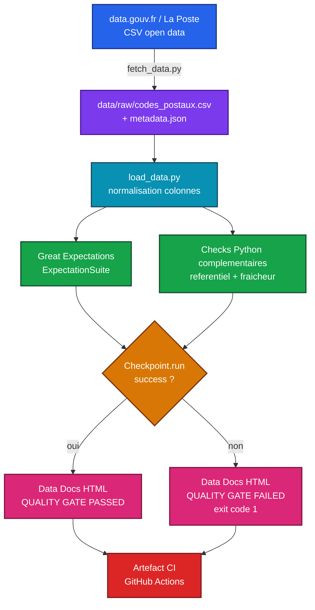

# data-quality-framework

<!-- adam-badges:start -->
[](https://github.com/Adam-Blf/data-quality-framework/commits)
[](https://hits.sh/github.com/Adam-Blf/data-quality-framework/)
[](https://github.com/Adam-Blf/data-quality-framework/commits)
[](https://github.com/Adam-Blf/data-quality-framework)
[](LICENSE)
[](CHANGELOG.md)
<!-- adam-badges:end -->

Framework de qualite de donnees pret pour la production - Great Expectations,
Python, GitHub Actions - applique a un jeu de donnees open data francais reel.

Version 0.1.0.

## Pourquoi Great Expectations plutot que Soda Core

Great Expectations a ete choisi parce qu'il genere nativement des rapports
HTML (Data Docs) sans outillage supplementaire, expose un objet de resultat
riche (`checkpoint.run().success`) directement exploitable comme porte de
qualite CI, et couvre completude/unicite/plages/schema avec des expectations
integrees testables unitairement. Soda Core reste un excellent choix (YAML
plus leger, moteur SQL natif) mais produit des rapports JSON/log plutot que
HTML, ce qui aurait demande un habillage maison pour respecter l'exigence de
rapport HTML publie en artefact CI.

## Jeu de donnees

**Base officielle des codes postaux** (La Poste / data.gouv.fr), environ
39 200 lignes, mise a jour reguliere par La Poste.

- Page dataset : https://www.data.gouv.fr/fr/datasets/base-officielle-des-codes-postaux/
- Ressource brute : https://data.laposte.fr/data-fair/api/v1/datasets/laposte-hexasmal/raw
- Licence : Licence Ouverte v2.0 (Etalab), reutilisation libre avec attribution.

Le fichier est telecharge par `scripts/fetch_data.py`, jamais commite (voir
`.gitignore`), pour toujours valider les donnees les plus fraiches.

## Suites de qualite implementees

| Categorie | Verification |
|---|---|
| Completude | `code_commune_insee`, `nom_commune`, `code_postal`, `libelle_acheminement` non nuls |
| Unicite | Ligne complete unique (`ExpectCompoundColumnsToBeUnique`) - voir note ci-dessous |
| Plage de valeurs | Code postal = 5 chiffres, regex stricte sur le code INSEE commune |
| Derive de schema | `ExpectTableColumnsToMatchSet(exact_match=True)` + volumetrie attendue (30k-45k lignes) |
| Coherence referentielle | Prefixe departement du code postal verifie contre la liste des departements francais reels (check Python complementaire) |
| Fraicheur | Age du fichier telecharge compare a `MAX_STALENESS_DAYS` (`.env.example`) |

### Decouverte reelle sur des donnees reelles

`code_commune_insee` seul n'est **pas** une cle unique dans ce fichier (4185
doublons observes) : une grande commune est repartie sur plusieurs lignes de
distribution (un hameau ou secteur postal par ligne). La cle reelle est la
ligne complete. Autre cas limite documente : Monaco (code INSEE `99138`,
prefixe postal `98`) est un Etat etranger souverain mais reste distribue par
La Poste francaise, donc legitimement present dans ce fichier francais -
traite comme exception acceptee, pas comme anomalie.

## Utilisation

```bash
make install         # cree le venv et installe les dependances
make fetch           # telecharge le jeu de donnees courant
make validate        # execute la suite, genere les Data Docs HTML, echoue si un seuil est franchi
make test            # tests unitaires (checks Python purs, sans reseau)
```

Rapports HTML generes sous `gx/uncommitted/data_docs/local_site/index.html`
(non commites, regeneres a chaque run - publies comme artefact CI).

### Demo : preuve que le build echoue sur donnees corrompues

```bash
make demo-corruption   # injecte des nulls, formats invalides, un prefixe departement inexistant, une colonne renommee
# -> QUALITY GATE FAILED, exit code 1

make demo-restore      # restaure le fichier propre et revalide
# -> QUALITY GATE PASSED, exit code 0
```

Preuve executee (2026-07-28) :

```
Injected corruption into .../data/raw/codes_postaux.csv
======================================================================
Great Expectations checkpoint success: False
Referential consistency check: {'check': 'postal_code_department_prefix_consistency', 'invalid_rows': 55, ...}
======================================================================
QUALITY GATE FAILED: at least one check did not pass.
```

## Architecture



## CI

Workflow `.github/workflows/data-quality.yml` : installe les dependances,
lance les tests unitaires, telecharge les donnees, execute la porte de
qualite, publie les Data Docs HTML en artefact. Declenche sur push, PR, et
chaque semaine (cron) pour detecter une derive de schema meme sans changement
de code.

## Stack

Python 3.12, Great Expectations 1.19, pandas, pytest, GitHub Actions.

## Licence

MIT, voir [LICENSE](LICENSE).
